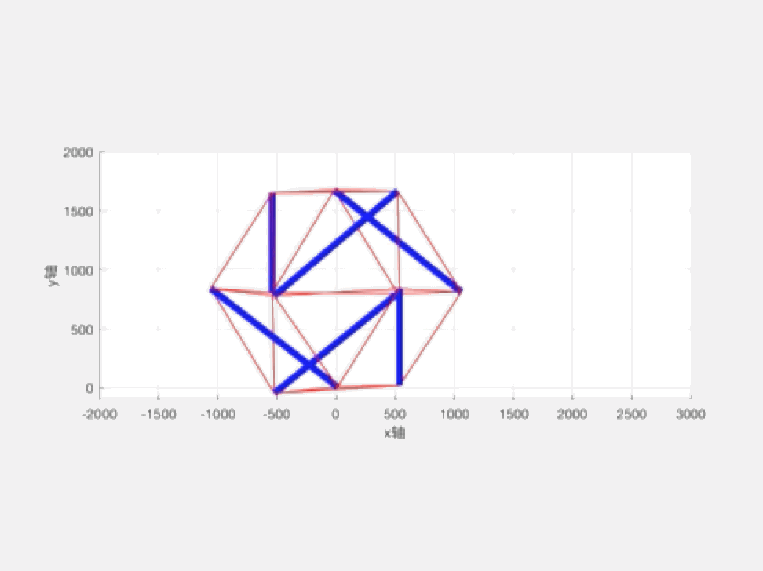
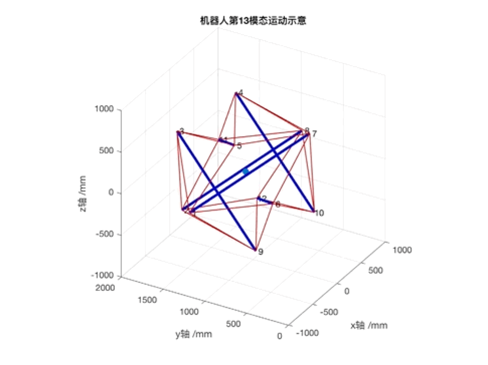
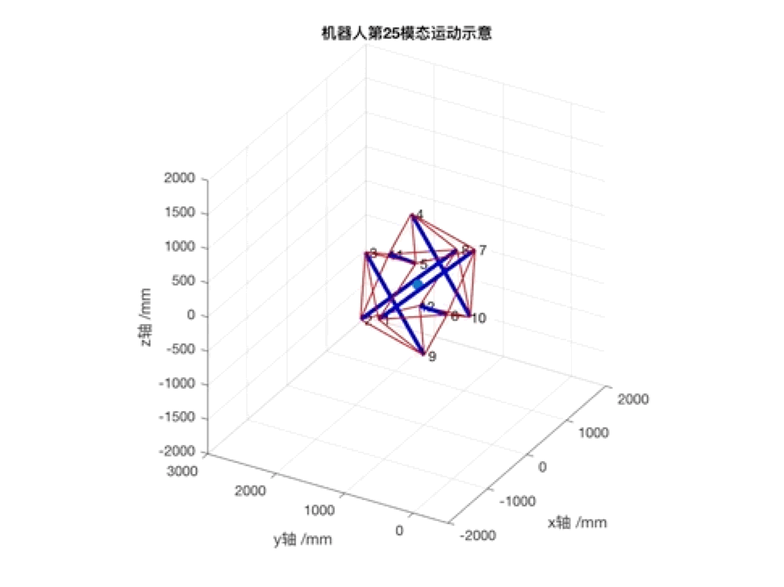

### About my work on NTRTsim
NTRTsim is an important part of my work at an undergraduate research project and graduation thesis. I've done several simulations using evolutionary algorithm and CPG control to generate different gaits for a 6-bar tensegrity robot. Some of the videos can be found at:

* https://youtu.be/bPanVJEUQm8 
* https://youtu.be/O7qYjjPgYPE
* https://youtu.be/QxUbTvVIs3c

Some Gif demos can be found in folder demos:)

* Robot rolling

* Robot rotate

* Robot shrink

* Robot move

* Robot pack

However, the code is not provided in this repo as the codes are transfered to other graduate students who are still working on improving the performance of such methods. This is also partly because I've been quite busy since I changed my major from ME to CS. If you have any questions regarding the simulations in above videos, you can email me at hesun@protonmail.com and I'd be happy to answer your questions. Finally, many thanks to the NTRTsim team for sharing the toolkit and it indeed helped me a lot!

NASA Tensegrity Robotics Toolkit
===============

3/19/15 - Warning: OS X Setup/Build Failures
---------
Currently the simulator is not compiling under OS X. We hope to have this resolved soon. In the meantime if you wish to use the simulator your best bet is to install a Linux VM and install NTRT there. In the near future we hope to include a .vmdk which contains Ubuntu pre-installed with NTRT and supporting tools/libraries -- the INSTALL file will be updated onec that is complete (currently aiming for ~3/22/15).

On that note, we're currently seeking a Mac dev who can help us ensure the simulator remains working on OS X. See this issue for more details:

https://github.com/NASA-Tensegrity-Robotics-Toolkit/NTRTsim/issues/143

UPDATE:  While we are working on a fix to the above, we have create a virtual machine image that could be installed on an OSX machine.  See:
http://ntrtsim.readthedocs.org/en/latest/setup.html#installing-ntrt-in-a-virtual-machine

About NTRT
---------

The NASA Tensegrity Robotics Toolkit (NTRT) is a collection of C++ and
MATLAB software modules for the modeling, simulation, and control of
Tensegrity Robots. The NTRT Simulator is a tensegrity-specific simulator
built to run ontop of the Bullet Physics Engine, version 2.82.

See INSTALL for instructions on how to install the library and build
from source. A getting started guide is available in src/README.dox,
which contains the main page of the DOxygen documentation.

The most accessible examples of tensegrity structures are in the
examples directory, we recommend starting with src/examples/3_prism
Additional README.dox files can be found in each folder with
additional information about that application or library. Additional 
examples can be found in example folders NestedTetrahedrons, SUPERball,
learningSpines or development folders: dev/tests and dev/btietz.

More information can be found at:

http://ti.arc.nasa.gov/tech/asr/intelligent-robotics/tensegrity/ntrt/

Documentation
--------

Doxygen documentation can be compiled in the source directory
(run "doxygen Doxyfile" when in src). Under Ubuntu 14.04, installing 
doxygen and graphviz (required) can be done by running "sudo apt-get 
install doxygen graphviz". HTML-based documentation can then be found 
under src/DoxyDocs/index.html.

Pre-built documentation for the repository can be found here:

http://ntrt.perryb.ca/doxygen

Tutorials
----------

Tutorials for NTRT (in progress) can be found at:

http://ntrtsim.readthedocs.org/en/latest/index.html

The source for that site is located under doc.

Additionally, some of our developers have recorded an introductory seminar
for NTRT, available at https://www.youtube.com/watch?v=jyP5h_t73xw.
To follow that video, please first compile and install NTRT (see 'INSTALL'
in this directory).

Build Status
---------

NTRTsim's automated build system (BuildBot) can be found at:

http://ntrt.perryb.ca/bb/waterfall

About Tensegrity Robots and The Goals of NTRT
----------
Tensegrity Robots are a biologically inspired approach to building
robots based on the tension networks of tensegrity structures, 
which have no rigid connections between elements.  The NTRT was created
to enable: the rapid co-exploration of structures and controls in 
a physics based simulation environment; the development of tensegrity 
robotics algorithms such as structural analysis, kinematics, and motion 
planning; and the validation of the algorithms and controls on hardware 
prototypes of the tensegrity robots.

The NTRT Simulator is a tensegrity-specific simulator built to run ontop
of the Bullet Physics Engine, version 2.82.  The NTRTsim includes a set 
of builder tools for specifying rods and strings as a set of points in 
Cartesian coordinates.  Structures built out of these rods and strings 
can be specified as a tree of substructures, and can be rotated and 
moved, which greatly simplifies the task of creating new tensegrity 
structures.  The NTRTsim also includes libraries for controllers such as 
Central Pattern Generators and a machine learning framework, which 
allows users to specify their own learning algorithms.  For strings, 
instead of the default Bullet softbodies, which are not physically 
accurate, we used a two point linear string model using Hooke's law 
forces with a linear damping term. We also have a contact dynamics module
for the cables, allowing them to interact with the structure and the environment.
Finally, terrains can be created, and the performance of the controller 
can be tested as the tensegrity robot moves through the simulated world.

Publications and Simulator Validation
----------------

We have published a 
[number of research papers](http://www.magicalrobot.org/BeingHuman/vytas-sunspirals-publications) 
using NTRT. Many of the models are available in the simulator. 
If you have questions on which models correspond to which paper, 
feel free to contact the authors at ntrtusers [at] lists [dot] nasa [dot] gov

We do our best to ensure the models in the simulator are physically 
realistic. A summary of the tests we do are available in 
[this video](https://youtu.be/VRdKwPsjmcI), and 
[this paper](http://www.sunspiral.org/vytas/cv/JRSI_tensegrity_final_releasable.pdf).

Mailing List
----------
All bugs, feature requests, and general discussion regarding NTRT should 
be sent to the NTRT user mailing list:

ntrtusers [at] lists [dot] nasa [dot] gov

To subscribe to this list, send an empty email message with the subject 
'subscribe' (without the quotes) to

ntrtusers-request [at] lists [dot] nasa [dot] gov

or visit the [List Subscription Page](https://lists.nasa.gov/mailman/listinfo/ntrtusers)

To contact the lead developers and project manager directly, send mail to:

ntrtusers-owner [at] lists [dot] nasa [dot] gov
